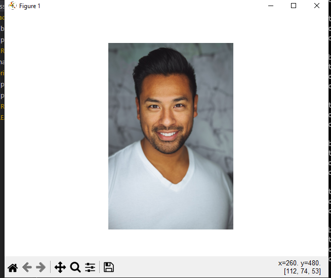
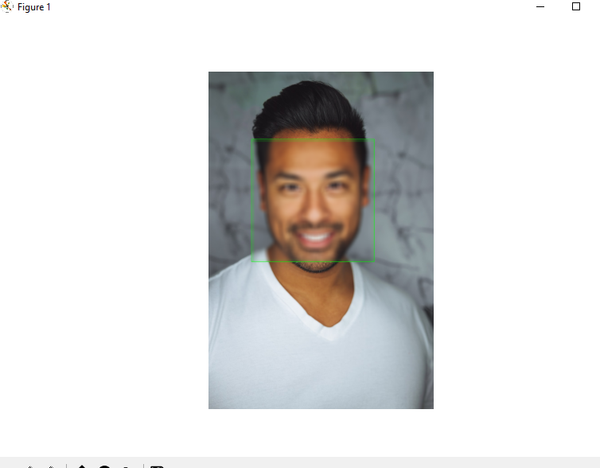

# Face Blurring
### this section for problem 1
 You are expected to write an algorithm that blurs out people's faces in any given colored image without affecting the remaining parts of the image, if any face exists.

 * an example

before :




after:


run it using this coomand
```
python Face_Blurring\blur_face.py
```